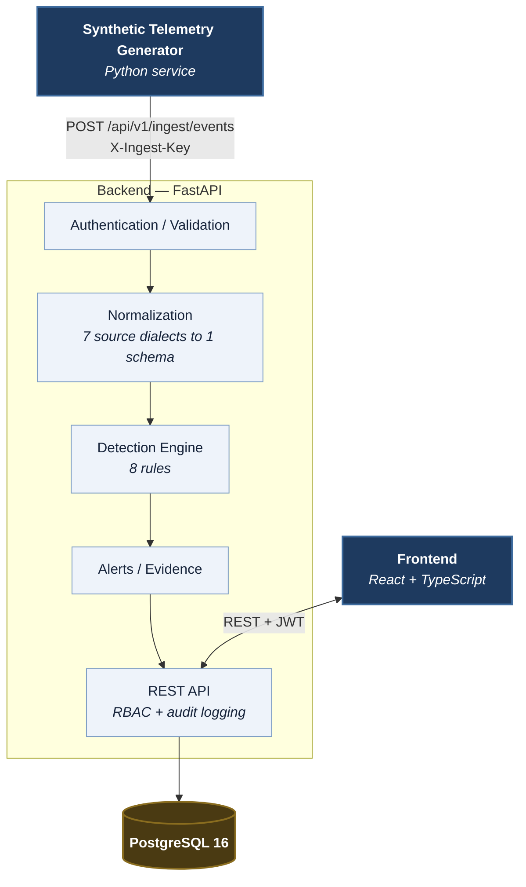

# SOC Analyst Dashboard

A functional Security Operations Center platform that reproduces the daily workflow of a SOC analyst. Synthetic telemetry is ingested through a real API, normalized onto a common schema, evaluated by a rule-based detection engine, raised as alerts, investigated, escalated into incidents, resolved with simulated response actions, and recorded in an append-only audit trail.

This is a working security application rather than a static dashboard or a mockup. Every figure displayed in the interface is derived from data that passed through the ingestion and detection pipeline.

## Overview

The platform implements the path an analyst follows during a shift:

```
Synthetic telemetry → ingestion → normalization → detection → alerts
   → investigation → incidents → simulated response → audit trail
```

A generator service produces synthetic security events across seven source types — authentication, firewall, DNS, web proxy, endpoint, system, and file telemetry. Each source has its own field vocabulary, and the normalization layer maps them onto a single internal schema so detection rules never see a source dialect.

Eight detection rules evaluate every batch. When a rule fires it records the evidence it derived — the failure count, the source addresses, the ports touched — alongside the events that justify the alert. Analysts triage from that queue, pivot into related events and source addresses, escalate into incidents, and close cases with a documented resolution.

Dashboard and analytics figures are computed from stored records rather than placeholder values. When no incident has been resolved, the mean-time-to-resolve tile reports that the metric is not yet measurable rather than displaying a zero.

I built this as a portfolio and learning project. It demonstrates how these systems work end to end; it is not a production enterprise SIEM and is not designed to replace one.

## Why I Built This

I wanted to understand security operations by building one, rather than by reading about it. Detection engineering is easiest to appreciate from the inside: tuning a rule until it stops firing on ordinary traffic, deciding what evidence an alert has to carry before it can actually be triaged, and working out exactly where authorization has to be enforced are all decisions this project required me to make and defend.

Designing and building the full pipeline let me demonstrate practical ability in:

- SOC analyst workflow and alert triage
- Security monitoring and telemetry normalization
- Detection engineering, including rule design and false-positive management
- Incident investigation and case management
- MITRE ATT&CK mapping
- Secure API design, authentication, and session management
- Role-based access control
- Database-backed analytics and audit logging
- Security testing
- Containerized deployment

## Key Capabilities

- **Synthetic telemetry ingestion** — a batch endpoint authenticated with a dedicated service key rather than a user session. Batches are capped at 500 events, and every event carries a stable identifier with a uniqueness constraint, so a retried batch cannot be counted twice.
- **Event normalization** — seven source dialects mapped onto one internal schema, with the original document retained verbatim so an analyst can always see exactly what arrived.
- **Detection engine** — eight rules, each a registered class with a validated configuration schema. Rule logic lives in code; thresholds live in the database and are tunable at runtime without redeployment, with every change audited.
- **MITRE ATT&CK mapping** — every rule carries a real published technique identifier, tactic, and technique name.
- **Alert triage** — a queue ranked by severity and confidence, filterable and sortable, with filter state carried in the URL so a view can be shared. Each alert stores the evidence the rule derived and links the events that justify it, so triage means reviewing the rule's reasoning rather than reconstructing it. Closing an alert requires a resolution note.
- **Incident management** — case workflow with an assembling timeline, notes, and lifecycle timestamps, so mean-time metrics are computed from recorded fact. Alerts can be escalated into a new incident or attached to an existing one.
- **IP investigation** — pivot on any address across events, alerts, and incidents, with a locally derived reputation verdict that shows its reasoning and is explicitly labelled as derived from this application's own data.
- **Analytics** — event and alert volume, authentication success and failure trends, severity distribution, top sources, most-triggered rules, ATT&CK coverage, and mean time to acknowledge, contain, and resolve.
- **Role-based access control** — four roles over twenty-two explicit permissions, enforced server-side on every request.
- **Audit logging** — append-only and admin-only, covering sign-ins, failed sign-ins, denied access attempts, status changes, notes, role changes, rule edits, and every simulated response action.
- **Simulated response actions** — five action types, each recording an intent in this application's database and nothing else.
- **Investigation tables** — server-side sorting against an allow-list of columns, severity ordered by real severity rather than alphabetically, and re-sorting that preserves every active filter.
- **Demo attack scenarios** — ten scenarios triggered on demand, each exercising the real ingestion, normalization, detection, and alerting pipeline.

## Architecture



Downstream of the alert, the workflow continues through the same API and database: analyst investigation, incident creation, simulated response actions, and audit entries.

The **generator** is a standalone service that produces benign background activity and, on demand or at a configured probability, attack scenarios. It talks to the backend over HTTP using a shared ingest key, exactly as an external log shipper would. The **frontend** enforces no security decisions of its own; it hides controls a user cannot use, but every permission is re-checked server-side.

Design decisions and their trade-offs are covered in [docs/architecture.md](docs/architecture.md).

### Detection runs synchronously during ingestion

Detection is evaluated inside the ingest request, in the same database transaction as the events that triggered it. I chose this deliberately for deterministic processing and simplicity: an alert and the events that justify it commit together, so an alert can never reference events that failed to persist, and the pipeline is straightforward to test.

This is a real trade-off. Synchronous evaluation puts rule execution on the ingest latency path, and at production volume this work belongs behind a task queue. Normalization and detection are separate layers specifically so that change would be a substitution rather than a rewrite.

**There is no asynchronous processing in this project** — no message queue, task worker, cache, or search cluster. The stack is exactly what is listed below.

## Technology Stack

| Layer | Technology |
|---|---|
| **Frontend** | React 18, TypeScript, Vite, Tailwind CSS, TanStack Query, Recharts |
| **Backend** | Python 3.13, FastAPI, Pydantic v2, SQLAlchemy 2.0, Alembic |
| **Database** | PostgreSQL 16 |
| **Security** | JWT (PyJWT), bcrypt, role-based access control, httpOnly refresh cookies |
| **Infrastructure** | Docker, Docker Compose |
| **Testing & quality** | pytest, Vitest, SQLite test harness, Ruff, TypeScript type checking |

The backend test suite runs against SQLite, so tests need no database container. The models use a portable column-type strategy to support this while keeping PostgreSQL as the deployment target.

## Detection Engineering

| Detection | MITRE ATT&CK | Tactic |
|---|---|---|
| Brute Force Authentication | [T1110](https://attack.mitre.org/techniques/T1110/) — Brute Force | Credential Access |
| Port Scan / Network Service Discovery | [T1046](https://attack.mitre.org/techniques/T1046/) — Network Service Discovery | Discovery |
| Successful Login After Repeated Failures | [T1078](https://attack.mitre.org/techniques/T1078/) — Valid Accounts | Initial Access |
| Impossible Travel | [T1078](https://attack.mitre.org/techniques/T1078/) — Valid Accounts | Initial Access |
| Web Attack Indicators | [T1190](https://attack.mitre.org/techniques/T1190/) — Exploit Public-Facing Application | Initial Access |
| Malicious File Hash Detected | [T1204.002](https://attack.mitre.org/techniques/T1204/002/) — User Execution: Malicious File | Execution |
| Privilege Escalation Indicator | [T1548](https://attack.mitre.org/techniques/T1548/) — Abuse Elevation Control Mechanism | Privilege Escalation |
| Suspicious PowerShell Execution | [T1059.001](https://attack.mitre.org/techniques/T1059/001/) — Command and Scripting Interpreter: PowerShell | Execution |

Every identifier is a real published technique. None are invented or approximate.

Three decisions shape the engine:

- **Rule logic in code, thresholds in the database.** A rule's reasoning belongs under version control and test; its numbers are operational tuning. Thresholds are editable at runtime, validated against the rule's own schema, and audited.
- **Alerts deduplicate on rule, entity, and time bucket.** A sustained attack accumulates evidence in a single alert rather than producing hundreds. This is enforced by a database uniqueness constraint, so two concurrent ingest requests cannot both insert.
- **Evidence is persisted, not recomputed.** An alert reviewed after its rule was retuned still explains itself using the values that actually caused it.

Ten synthetic scenarios exercise the real pipeline rather than inserting alerts directly: `brute_force`, `password_spray`, `credential_compromise`, `port_scan`, `network_sweep`, `web_attack`, `impossible_travel`, `suspicious_powershell`, `malware_execution`, `privilege_escalation`. Each is mapped to the detection it is designed to trigger. Full thresholds and rule detail are in [docs/detection-rules.md](docs/detection-rules.md).

## Security Design

**Authentication** — bcrypt hashing at a configurable cost with the 72-byte truncation limit explicitly guarded; algorithm-pinned JWTs; typed access and refresh tokens, so a refresh token cannot be replayed as an access token; access tokens held in frontend memory rather than browser storage; refresh tokens as httpOnly, SameSite=Lax cookies scoped to the auth path and rotated on use; timing-equalized login, so an unknown account performs comparable work to a real one; token-version invalidation, so changing a password immediately invalidates that user's outstanding tokens.

**Authorization** — an explicit permission model of twenty-two permissions across four roles rather than a role hierarchy. Endpoints require permissions, never role names. An unrecognised role grants nothing, and the user's role is re-read from the database on every request rather than trusted from the token.

**Input handling and data access** — parameterized queries throughout with no string interpolation into SQL; allow-listed sort fields, so a column name from a query string is never interpolated; server-side pagination limits; request body size limits enforced from headers before the body is buffered; explicit CORS origins with no wildcards.

**Operational** — redacted logging, so credential fields cannot reach a log line or error body; no hard-coded application secrets, with the signing key and ingest key having no defaults and the application refusing to start on a placeholder or short key; a startup check that refuses to seed the documented demo credentials when the environment is configured as production; non-root Docker containers with `no-new-privileges`; published ports bound to loopback by default.

**Not implemented.** No multi-factor authentication, distributed or cache-backed rate limiting, TLS termination, production-grade infrastructure, external firewall integration, endpoint isolation, real account disabling, or real host isolation. Rate limiting exists but is process-local. Response actions are simulated and control nothing outside this application's database.

Controls and known weaknesses are documented in full in [docs/security.md](docs/security.md).

## Quick Start

Docker Desktop is required; Python, Node, and PostgreSQL all run in containers.

```powershell
git clone https://github.com/Kiseki-kun/SOC-Analyst-Dashboard.git
cd SOC-Analyst-Dashboard
.\scripts\init-env.ps1
.\scripts\start.ps1
```

`init-env.ps1` creates `.env` from the template, generates strong random values for the signing key and ingest key, and verifies the result. `start.ps1` validates `.env`, then builds and starts the stack. Run them as two separate commands and confirm the first reports success before starting.

On first start the backend waits for PostgreSQL, applies migrations, synchronizes detection rules and the IOC watchlist, and seeds demo users when demo seeding is enabled.

| Service | URL |
|---|---|
| Frontend | http://localhost:54173 |
| API documentation | http://localhost:58000/docs |
| PostgreSQL | localhost:55432 |

Host ports sit above 49152 to avoid the ephemeral port range and are configurable in `.env`.

| Script | Purpose |
|---|---|
| `.\scripts\check-env.ps1` | Diagnose the environment without starting anything |
| `.\scripts\run-tests.ps1` | Run the test suites |
| `.\scripts\trigger-scenario.ps1 -List` | List available demo scenarios |
| `.\scripts\trigger-scenario.ps1 brute_force` | Trigger a scenario through the real pipeline |
| `.\scripts\reset-database.ps1` | Reset the database |

Setup detail, Windows and Docker specifics, and troubleshooting are in [docs/development.md](docs/development.md).

**Running without Docker** is possible — PostgreSQL, the backend, the frontend, and the generator each run as separate processes — but requires PostgreSQL 16, Python 3.13, and Node installed locally, and four configuration changes: `POSTGRES_HOST` to `localhost`, `GENERATOR_BACKEND_URL` and `VITE_API_BASE_URL` to the local backend, the frontend's own origin added to `CORS_ORIGINS`, and a `.env` present in each service's working directory, since Compose otherwise supplies those variables directly.

## Demo Accounts

| Role | Email | Demonstrates |
|---|---|---|
| Admin | `admin@soc.example.com` | Full access, including user management, rule configuration, and the audit log |
| Responder | `responder@soc.example.com` | Analyst capabilities plus incident assignment, closure, and simulated response actions |
| Analyst | `analyst@soc.example.com` | Alert triage, investigation, incident creation, and notes |
| Viewer | `viewer@soc.example.com` | Read-only access |

Signing in as each role is the quickest way to see authorization enforced: controls a role cannot use are hidden in the interface, and the corresponding API calls are refused server-side.

The repository includes documented demo credentials in `.env.example` for local demonstration purposes. Because the repository is public, these credentials are public as well. They are intended for local demonstration and should be replaced when deploying the application in another environment. The application enforces this for the case that matters: it refuses to start if configured as a production environment while demo seeding is enabled and the documented passwords are unchanged.

## Recommended Demo

1. Sign in as the Analyst account and open the Dashboard.
2. Observe incoming synthetic telemetry as the generator produces events.
3. Trigger a brute-force scenario: `.\scripts\trigger-scenario.ps1 brute_force`
4. Open the generated alert and review its evidence and related events.
5. Pivot into Events using the links from the alert.
6. Investigate the source IP address and review its locally derived reputation.
7. Create an incident from the alert, or attach the alert to an existing one, and add investigation notes.
8. Sign in as the Responder account to assign and progress the incident, then execute a simulated response action.
9. Sign in as the Admin account and review the audit trail covering every step above.

Each scenario and the detection it exercises are documented in [docs/demo-scenarios.md](docs/demo-scenarios.md).

## Testing

Both suites were run against the current state of the repository.

| Suite | Tests | Coverage |
|---|---|---|
| Backend | 332 | Authentication, authorization, detection logic, normalization, ingestion, alert and incident workflows, analytics, audit logging, sorting, configuration validation, security controls |
| Frontend | 50 | API client behaviour including token refresh and error handling, permission gating, formatting, components, table sorting and its accessibility |

```powershell
.\scripts\run-tests.ps1
```

Notable security and integration tests:

- **Route protection** — walks the live OpenAPI schema and asserts that no endpoint outside a documented allow-list is reachable without credentials, so a router added later without an authentication dependency fails automatically.
- **False positive control** — benign generated traffic across five independent random seeds must raise zero alerts. A detection set that fires on ordinary activity trains analysts to ignore it.
- **Detection scenario coverage** — every one of the ten scenarios must trigger its intended rule through the real pipeline, and a further test asserts the scenario list and expected-detection map cannot drift apart.
- **Authentication timing** — an unknown account and a wrong password must return identical responses, and a second test measures both paths and fails if one differs materially. Response equality alone does not prove the absence of a timing oracle.
- **Authorization coverage** — role and permission boundaries asserted per endpoint, including that an unrecognised role grants no access.
- **Sort field allow-listing** — a sort parameter naming a non-allow-listed column, a sensitive column, or a value containing SQL must be rejected rather than interpolated.
- **Runtime detection registration** — verifies every enabled rule is registered and available to the running application, not only to the test process. Several of these spawn a clean interpreter and assert the application server's own import path yields a fully populated registry.

Backend code is linted with Ruff; the frontend is type-checked with the TypeScript compiler in strict mode.

## Documentation

| Document | Contents |
|---|---|
| [docs/portfolio.md](docs/portfolio.md) | Project overview, analyst workflow, engineering decisions, and roadmap |
| [docs/architecture.md](docs/architecture.md) | System shape, ingest path, and the trade-offs behind each design decision |
| [docs/detection-rules.md](docs/detection-rules.md) | All eight rules, their thresholds, and ATT&CK mappings |
| [docs/security.md](docs/security.md) | Security controls implemented, and known weaknesses stated plainly |
| [docs/api.md](docs/api.md) | REST API reference and conventions |
| [docs/demo-scenarios.md](docs/demo-scenarios.md) | Each demo scenario and the detection it exercises |
| [docs/development.md](docs/development.md) | Development setup, Windows and Docker specifics, troubleshooting |
| [docs/final-audit.md](docs/final-audit.md) | Pre-release audit: findings, fixes, and verification scope |

## Limitations

These are engineering trade-offs, stated directly.

- **Detection is synchronous.** Deterministic and transactionally consistent, at the cost of putting rule evaluation on the ingest latency path. At production volume this belongs behind a task queue.
- **PostgreSQL rather than a dedicated search cluster.** With targeted indexes this performs well at the volumes handled here. Full-text search across raw payloads at genuine SOC scale would call for a purpose-built search backend.
- **Rate limiting is process-local.** Failed-login throttling holds state in process memory, so it is per-worker and resets on restart.
- **Token revocation is per-user, not per-session.** Changing a password invalidates all of that user's tokens; revoking one session while leaving others active is not supported.
- **No multi-factor authentication.**
- **The Docker configuration is development-oriented.** Bind-mounted source, the Vite dev server, and backend reload. Production would need a multi-stage build serving static assets and a proper worker configuration.
- **Single-node.** No horizontal scaling, replication, or backup strategy.
- **Response actions are simulated.** A permanent design boundary rather than an unfinished feature.

## Future Improvements

- Move detection behind a task queue so ingestion and rule evaluation scale independently
- Per-session token revocation using a deny list keyed on the existing token identifier claim
- Multi-factor authentication
- A production deployment profile with a multi-stage frontend build serving static assets
- Richer alert correlation, assembling one incident from several related detections
- Scheduled retention and archival, currently a manual maintenance task
- Configurable detection rules, so simple threshold detections can be added without code

## Ethical Scope

This is educational and portfolio software. All telemetry is synthetic and generated locally:

- IP addresses come from ranges reserved for documentation (RFC 5737) or RFC 1918 private space
- Malicious domains use the reserved `.invalid` TLD
- File hashes are invented
- Demo credentials exist for demonstration only
- Response actions are simulated and recorded only in this application's database

No real credentials are used, no real hosts are contacted or attacked, no real malware is used or referenced, and no external firewall, directory service, endpoint agent, or infrastructure is controlled by any response action.

There is no code path from this system to an external enforcement point. That capability is absent by design, not disabled by configuration. The project cannot be pointed at real infrastructure, because no such capability exists in the codebase.
