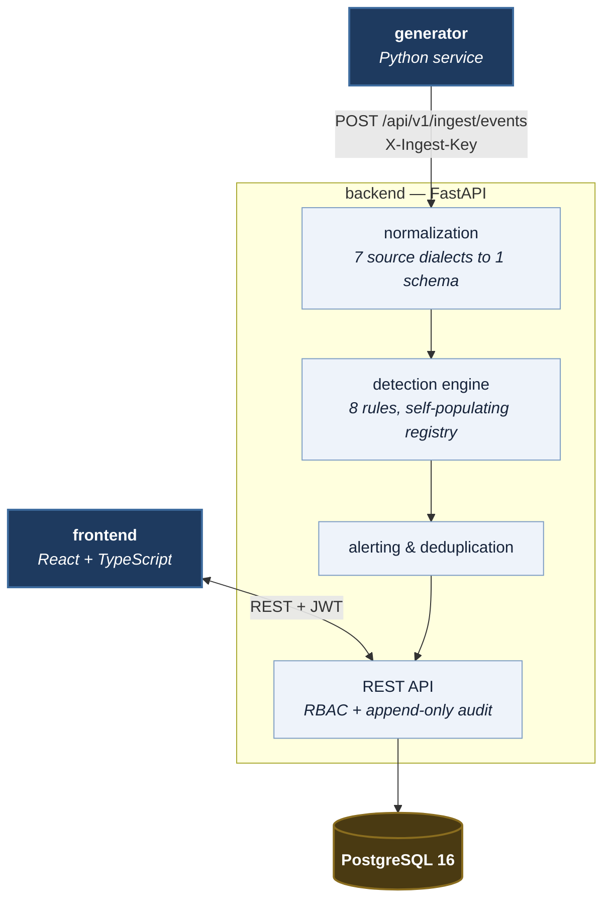
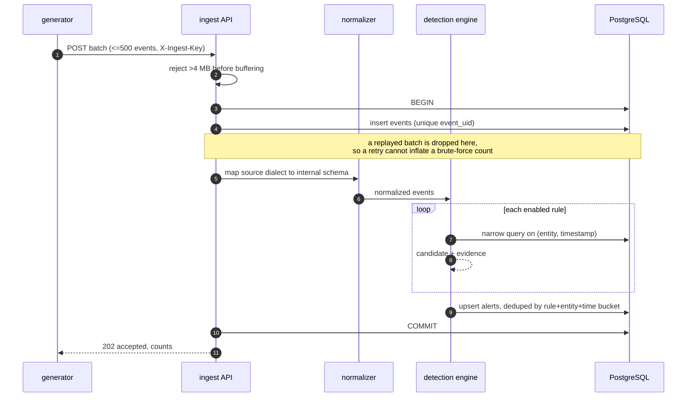

# Architecture

## The shape of the system

Four services.



Telemetry flows one way. Everything else is a query.

## The ingest path, in order

1. **Receive.** `POST /api/v1/ingest/events` accepts a batch (max 500).
   Authenticated with a shared service key, not a user session — the generator
   is a machine with exactly one capability.
2. **Deduplicate.** Every event carries a stable `event_uid` with a unique
   constraint. This matters more than it looks: the generator retries on
   timeout, and a replayed batch of failed logins would otherwise inflate a
   brute-force count into a false positive.
3. **Normalize.** Each source dialect is mapped onto one internal schema. The
   auth log says `user`, the proxy says `client_user`, the endpoint agent says
   `subject_account` — detection rules see `username`.
4. **Persist.** Normalized fields become columns; the original document is kept
   verbatim in `raw` so an analyst can always see what actually arrived.
5. **Detect.** Every enabled rule evaluates the batch. Rules query narrowly
   against composite `(entity, timestamp)` indexes.
6. **Alert.** Candidates are deduplicated against open alerts by
   `rule + entity + time bucket`, so a sustained attack accumulates evidence in
   one alert rather than producing one per ingest call.

All of this happens in a single transaction. An alert and the events that
justify it commit together — an alert referencing events that failed to persist
would be unexplainable to whoever investigates it.



## Decisions, and what they cost

**Detection runs synchronously inside the ingest request.** No queue, no broker,
no worker. At this scale that is a feature: detection is deterministic, testable
in isolation, and an alert exists by the time the ingest call returns. The cost
is that ingest latency grows with rule count, and a slow rule blocks the batch.
A production deployment handling real volume would put detection behind a queue
and accept the eventual-consistency window that brings. This is a genuine
trade-off, not an oversight.

**Registration is enforced by the registry, not by convention.** Rules register
through a decorator, which only runs when the module is imported. Relying on
someone remembering that import cost this project a silent production outage —
the API process ran for half an hour evaluating nothing while every test passed.
The registry now imports its rules on first use, and startup logs the active
rule count. See `docs/detection-rules.md` for the full account.

**Rule logic in code, thresholds in the database.** Matching logic is versioned,
reviewed and unit-tested like any other code. Thresholds are operational
settings an administrator changes during a noisy afternoon. Putting either in
the other's place is a mistake: rules-as-data becomes an untestable DSL, and
thresholds-in-code means a redeploy to silence a noisy detection at 2am.

**Synchronous SQLAlchemy.** FastAPI runs sync dependencies in a threadpool, so
throughput is adequate here. Async SQLAlchemy would add a class of event-loop
and greenlet failures that are unpleasant to diagnose — a poor trade in an
environment where the full stack could not be run during development.

**PostgreSQL for event storage, not Elasticsearch.** The brief allowed a search
cluster; this does not use one. Postgres with targeted composite indexes handles
this volume comfortably, and Elasticsearch would add roughly 1.5 GB of image and
a service that wants 2 GB of heap to itself. See *Limitations* for where that
choice stops scaling.

**Portable column types.** `JSONB` and native `UUID` on PostgreSQL degrade to
`JSON` and `CHAR(32)` on SQLite via SQLAlchemy variants. This is what lets the
detection engine, RBAC and service layer be tested without a database server.
PostgreSQL remains the only supported runtime target; SQLite is a test harness.

## Repository layout

```
SOC-Analyst-Dashboard/
├── backend/
│   ├── app/
│   │   ├── api/v1/routers/     one router per domain
│   │   ├── cli/                seeding entry points
│   │   ├── core/               config, security, RBAC, logging, enums
│   │   ├── db/                 engine, session, base types
│   │   ├── detection/          rule framework + the 8 rules
│   │   ├── models/             SQLAlchemy models
│   │   ├── schemas/            Pydantic request/response models
│   │   └── services/           normalization, ingest, detection engine, audit,
│   │                           analytics, investigation, incidents
│   ├── alembic/                migrations
│   └── tests/                  unit / integration / security
├── frontend/
│   └── src/
│       ├── components/         UI primitives and charts
│       ├── hooks/              TanStack Query bindings
│       ├── layouts/            app shell
│       ├── lib/                API client, auth, permissions, formatting
│       └── pages/              one per route
├── generator/                  synthetic telemetry service
├── database/init/              extensions created on first boot
├── docs/                       this documentation
└── scripts/                    PowerShell helpers
```

## Database schema

Twelve tables. The ones that carry the workflow:

| Table | Role |
|-------|------|
| `security_events` | Normalized telemetry. Six composite indexes, each backing a query the application actually issues. |
| `detection_rules` | Rule metadata, thresholds, enable flag, ATT&CK mapping. |
| `alerts` | Detections. `dedup_key` is uniquely constrained — the database, not application logic, arbitrates duplicates. |
| `alert_events` | Which events justify which alert. Makes an investigation reproducible. |
| `incidents` | Case management, with lifecycle timestamps so mean-time metrics are computed from recorded fact. |
| `incident_timeline_entries` | The narrative an analyst writes up, distinct from the audit log. |
| `response_actions` | Simulated containment. `simulated` is stored explicitly and returned in every response. |
| `audit_logs` | Append-only. No update or delete path exists anywhere in the API. |
| `ioc_watchlist` | Indicators. Doubles as live detection input. |

Indexes were chosen against specific queries rather than added to every column.
The detection engine's windowed lookups are the hot path, so
`(src_ip, timestamp)`, `(username, timestamp)` and `(event_type, timestamp)`
serve both the filter and the range scan in one structure.
