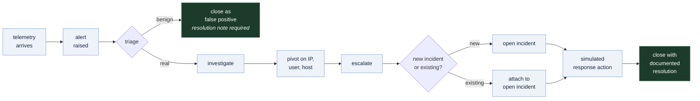

# Portfolio notes

Written for two readers: someone deciding in ninety seconds whether this project
is worth a closer look, and someone who has decided to interview me about it.

---

## The ninety-second version

A working SOC platform. Synthetic telemetry from seven source types is ingested,
normalized onto one schema, evaluated by eight detection rules, raised as
deduplicated alerts, triaged, escalated into incidents, and closed with a
documented resolution — under role-based access control, with an append-only
audit trail throughout.

| | |
|---|---|
| **Backend** | Python, FastAPI, Pydantic v2, SQLAlchemy 2.0, Alembic, PostgreSQL 16 |
| **Frontend** | React 18, TypeScript (strict, `noUncheckedIndexedAccess`), Vite, Tailwind, TanStack Query |
| **Deployment** | Docker Compose, four services, non-root containers |
| **Tests** | 332 backend, 50 frontend |
| **Detections** | 8 rules, each mapped to a real published ATT&CK technique |
| **Authorization** | 4 roles over 22 explicit permissions, enforced server-side |

The thing that distinguishes it from most portfolio dashboards: the data model,
the detection engine and the analyst workflow were built first, and the
interface displays what they produce. Every number on the dashboard traces to a
row in the database. When nothing has been resolved yet, the
mean-time-to-resolve tile reads "Not yet measured" rather than a fabricated
zero.

---

## What an analyst actually does here

Three decisions in that flow are deliberate and worth asking me about:

**Closing an alert requires a resolution note.** Not a dropdown — free text,
validated to reject whitespace-only input. An alert queue where things vanish
without explanation is how institutional knowledge is lost. The same alert will
fire again next month, and the note is the only thing that tells the next
analyst what happened last time.

**Escalation offers "attach to an existing incident."** The obvious
implementation creates a new incident per alert, and it is wrong: a real
intrusion produces many alerts belonging to one case. Forcing one-to-one
creation trains the analyst to produce duplicate incidents, and mean-time
metrics computed over duplicates are meaningless.

**Pivoting preserves context.** Moving from an alert to the related events
carries the source IP and the sort order into the URL, so the analyst lands on a
filtered view rather than an unfiltered firehose they must re-filter by hand.

---

## The detection engine

Eight rules. Each is a registered class with a Pydantic-validated config schema.

| Rule | ATT&CK | Default severity |
|---|---|---|
| `brute_force_authentication` | [T1110](https://attack.mitre.org/techniques/T1110/) | High, Critical when spraying |
| `port_scan` | [T1046](https://attack.mitre.org/techniques/T1046/) | Medium, High when broad |
| `suspicious_login_after_failures` | [T1078](https://attack.mitre.org/techniques/T1078/) | Critical |
| `impossible_travel` | [T1078](https://attack.mitre.org/techniques/T1078/) | High |
| `web_attack_indicators` | [T1190](https://attack.mitre.org/techniques/T1190/) | High |
| `malicious_file_hash` | [T1204.002](https://attack.mitre.org/techniques/T1204/002/) | Critical |
| `privilege_escalation` | [T1548](https://attack.mitre.org/techniques/T1548/) | High, Critical when it succeeds |
| `suspicious_powershell` | [T1059.001](https://attack.mitre.org/techniques/T1059/001/) | High, Critical at high score |

Every identifier is a real published technique. None are invented, and none are
approximate.

### Three design decisions

**Logic in code, thresholds in the database.** A rule's *reasoning* is Python
and belongs under version control and test. A rule's *numbers* — five failures
in five minutes — are operational tuning, and an analyst who has to open a pull
request to change a threshold from 5 to 8 will instead stop tuning. Thresholds
are editable at runtime, validated against the rule's own schema, and every
change is audited.

**Alerts deduplicate on `rule + entity + time bucket`.** A sustained brute-force
attempt is one alert that accumulates evidence, not four hundred alerts. This is
enforced by a database unique constraint rather than an application check,
because two concurrent ingest requests will otherwise both find nothing and both
insert.

**Evidence is persisted, not recomputed.** When a rule fires it stores what it
saw — the failure count, the source addresses, the ports touched. Triage means
reading the rule's reasoning, not reconstructing it. A rule whose thresholds
were retuned last week would otherwise "explain" an old alert using today's
numbers.

### Detection runs inside the ingest transaction

Synchronous, in the same transaction as the events. That is a real trade-off,
and I would not do it at production volume — it puts rule evaluation on the
ingest latency path, and one slow rule slows everything. At this scale it buys
something worth more: an alert and the events that justify it commit together.
An alert that references events which failed to persist is unexplainable to
whoever picks it up. The production answer is a queue, and the migration path is
the reason normalization and detection are already separate layers.

---

## Security architecture

Full detail, including the weaknesses, is in [security.md](security.md). The
shape of it:

**Authentication.** Access tokens are 15 minutes, algorithm-pinned, carrying a
`typ` claim so a refresh token cannot be replayed as an access token, and held
in memory — never `localStorage`, where one XSS yields a portable credential.
The refresh token is an httpOnly, `SameSite=Lax` cookie scoped to
`/api/v1/auth`, so JavaScript cannot read it and it is not attached to unrelated
API calls. Refresh tokens rotate on use.

**Authorization is an explicit permission map, not a role hierarchy.**
Twenty-two permissions across four roles — 7 for a viewer, 12 for an analyst,
16 for a responder, all 22 for an admin. A hierarchy cannot express "a responder may close
an incident but may not create users", and every real SOC has capabilities that
do not nest. Endpoints require *permissions*, never role names. Unrecognised
roles grant zero permissions — it fails closed. The role is re-read from the
database on every request rather than trusted from the token, so an
administrator demoted five minutes ago loses access now rather than when their
token happens to expire.

**Injection.** Parameterised queries throughout; no string interpolation into
SQL anywhere. Sort columns come from a fixed allow-list, and there is a test
asserting that `hashed_password` and a sort parameter containing SQL are both
rejected rather than interpolated.

**A route-coverage test walks the live OpenAPI schema** and asserts that no
endpoint outside a small documented allow-list is reachable without credentials.
A router added later without an auth dependency fails that test automatically.
Reviewers forget; tests do not.

---

## Bugs worth talking about

These are the most useful part of this document. A project with no defect
history either was not tested or is not being described honestly.

### The detection registry was empty in the running API

Every rule was implemented. Every rule was tested. The suite was green. And the
running API detected nothing, because rules register via an import
side-effect — a decorator that only runs if the module is imported — and
`app.detection.rules` was imported by the seed CLI and by `conftest.py`, but not
by anything on the path `uvicorn` actually takes.

The test suite passed because the *test fixture* performed an import the
application did not. That is the most instructive failure in the project: the
tests were not wrong about the code, they were wrong about the environment.

The fix made the registry self-populating with a lock, and added regression
tests that spawn a *clean interpreter* and assert that the exact import chain
uvicorn performs ends with eight rules registered. I verified those tests were
meaningful by reverting the fix in a throwaway copy: 61 pre-existing tests still
passed while the new file failed six times.

There is also a startup coverage check that logs which rules registered, so the
next instance of this failure announces itself instead of being silent.

### The timing-equalisation control was real, and did nothing

Login responses were byte-identical for an unknown account and a wrong password,
with a test asserting exactly that. The test passed. The control was still
broken: the dummy bcrypt hash burned on the unknown-account path was generated
at cost 10, while real accounts hash at cost 12. Bcrypt cost is a power of two,
so the "equalising" work was a quarter of the real work.

Measured during the audit: **75.9 ms for an unknown address against 344.4 ms for
a known one — a 4.5x gap**, trivially measurable across a network, which is
precisely the enumeration oracle the control existed to remove.

The dummy hashes are now generated lazily per cost factor and matched to the
configured `BCRYPT_ROUNDS`. The second test is the one that matters: it measures
both paths and fails if the ratio exceeds 3x. A control that looks right and
does nothing is worse than no control, because its presence stops anyone from
looking.

### Impossible travel fired on entirely benign traffic

Three of five seeded runs produced a false positive. The instinct is to raise
the threshold. The rule was right: the *generator* was randomising each user's
location on every login, so ordinary activity genuinely did look like
teleportation. Fixing the telemetry rather than loosening the detection is the
whole point — raising the threshold would have hidden a data-quality problem
behind a less sensitive rule.

### A sort that put nulls first when descending

My own test caught this one. Negating the comparator to reverse the sort also
negated the missing-value handling, so rows with no value sorted to the top when
descending — exactly where an analyst is looking. Missing values are now placed
before the direction flip, so they sort last in both directions.

---

## Things I would ask me

- Why synchronous detection, and what breaks first at volume?
- Why an explicit permission map instead of role inheritance?
- Why is the access token in memory rather than `localStorage`?
- Why deduplicate alerts in the database rather than the application?
- How do you know the false-positive test is meaningful and not just passing?
- What is still wrong with this system?

That last one has a real answer, and it is in [security.md](security.md) under
"Known weaknesses" — in-process rate limiting, revocation that is per-user
rather than per-session, no MFA, and a development-grade Docker configuration.
A security project claiming to have no weaknesses is not credible.

---

## Roadmap

Ordered by what I would actually do next, not by what sounds most impressive.

1. **Move detection behind a task queue.** The largest architectural change and
   the one that matters first at volume. Normalization and detection are already
   separate layers precisely to make this a substitution rather than a rewrite.
2. **Per-session token revocation.** A `jti` deny list in Redis, so one stolen
   token can be revoked without ending a user's other sessions, and "log out
   this device" becomes possible.
3. **Shared rate-limit state.** The current limiter is per-process and resets on
   restart. Redis makes it mean something across workers.
4. **A production Compose profile.** Multi-stage frontend build serving static
   assets, no bind mounts, no `--reload`, a real worker configuration.
5. **Alert correlation across rules.** One incident assembled from several
   related detections — closer to how an intrusion actually presents than
   one-alert-one-case.
6. **MFA**, once there is a production profile worth protecting.
7. **Rules-as-config.** A loader so simple threshold detections can be added
   without code, keeping code for rules that genuinely need logic.
8. **Scheduled retention and archival**, currently a manual maintenance task.

---

## Boundaries, permanently

Everything is synthetic. Addresses come from ranges IANA reserves for
documentation (RFC 5737) or RFC 1918 private space; malicious domains use the
reserved `.invalid` TLD; every file hash is invented; no real credentials, hosts,
malware or personal data appear anywhere.

Every response action is simulated and recorded only in this application's own
database. There is no code path from this system to a firewall, a directory
service, or an endpoint agent — not disabled, not configured off, absent. That
is a design boundary and it is permanent.
